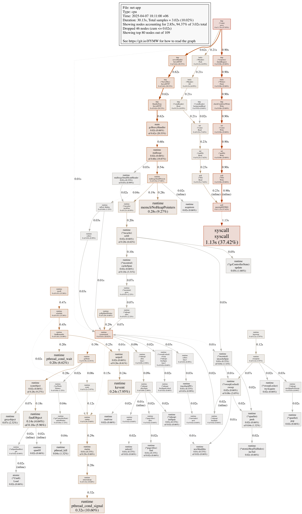
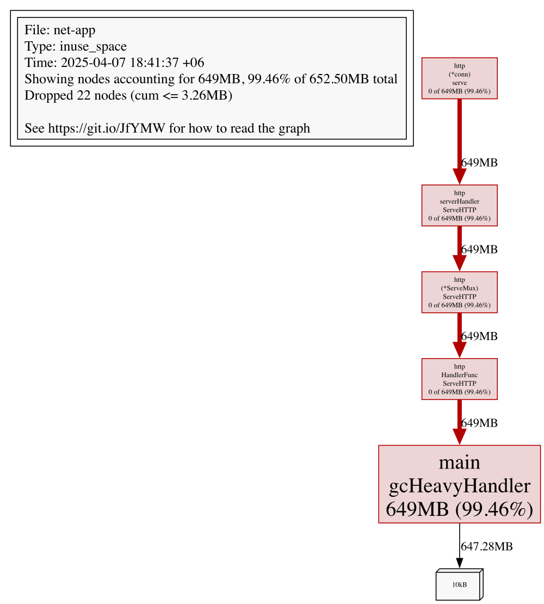

# Practical Example: Profiling Networked Go Applications with `pprof`

This section walks through a demo application instrumented with benchmarking tools and runtime profiling to ground profiling concepts in a real-world context. It covers identifying performance bottlenecks, interpreting flame graphs, and analyzing system behavior under various simulated network conditions.

## CPU Profiling in Networked Apps

The demo application is intentionally designed to be as simple as possible to highlight key profiling concepts without unnecessary complexity. While the code and patterns used in the demo are basic, the profiling insights gained here are highly applicable to more complex, production-grade applications.

To enable continuous profiling under load, we expose `pprof` via a dedicated HTTP endpoint:

```go

```

??? example "full `net-app`'s source code"
    ```go
    
    ```

The next step will be to establish a connection with the profiled app and collect samples:

```bash
go tool pprof http://localhost:6060/debug/pprof/profile?seconds=30
```

View results interactively:

```bash
go tool pprof -http=:7070 cpu.prof # (1)
```

1. the actual `cpu.prof` path will be something like `$HOME/pprof/pprof.net-app.samples.cpu.004.pb.gz`

or you can save the profiling graph as an `svg` image.

## CPU Profiling Walkthrough: Load on the `/gc` Endpoint

We profiled the application during a 30-second load test targeting the `/gc` endpoint to see what happens under memory pressure. This handler was intentionally designed to trigger allocations and force garbage collection, which makes it a great candidate for observing runtime behavior under stress.

We used Go’s built-in profiler to capture a CPU trace:

??? example "CPU profiling trace for the `/gc` endpoint"
    { width="1602" }

This gave us 3.02 seconds of sampled CPU activity out of 30 seconds of wall-clock time—a useful window into what the runtime and application were doing under pressure.

## Where the Time Went

### HTTP Stack Dominates the Surface

As expected, the majority of CPU time was spent on request handling:

- `http.(*conn).serve` accounted for nearly 58% of sampled time
- `http.serverHandler.ServeHTTP` appeared prominently as well

This aligns with the fact that we were sustaining constant traffic. The Go HTTP stack is doing the bulk of the work, managing connections and dispatching requests.

### Garbage Collection Overhead is Clearly Visible

A large portion of CPU time was spent inside the garbage collector:

- `runtime.gcDrain`, `runtime.scanobject`, and `runtime.gcBgMarkWorker` were all active
- Combined with memory-related functions like `runtime.mallocgc`, these accounted for roughly 20% of total CPU time

This confirms that `gcHeavyHandler` is achieving its goal. What we care about is whether this kind of allocation pressure leaks into real-world handlers. If it does, we’re paying for it in latency and CPU churn.

### I/O and Syscalls Take a Big Slice

We also saw high syscall activity—especially from:

- `syscall.syscall` (linked to `poll`, `Read`, and `Write`)
- `bufio.Writer.Flush` and `http.response.finishRequest`

These functions reflect the cost of writing responses back to clients. For simple handlers, this is expected. But if your handler logic is lightweight and most of the time is spent just flushing data over TCP, it’s worth asking whether the payloads or buffer strategies could be optimized.

### Scheduler Activity Is Non-Trivial

Functions like `runtime.schedule`, `mcall`, and `findRunnable` were also on the board. These are Go runtime internals responsible for managing goroutines. Seeing them isn’t unusual during high-concurrency tests—but if they dominate, it often points to excessive goroutine churn or blocking behavior.

## Memory Profiling: Retained Heap from the `/gc` Endpoint

We also captured a memory profile to complement the CPU view while hammering the `/gc` endpoint. This profile used the `inuse_space` metric, which shows how much heap memory is actively retained by each function at the time of capture.

We triggered the profile with:

```bash
go tool pprof -http=:7070 http://localhost:6060/debug/pprof/heap
```

??? example "Memory profiling for the `/gc` endpoint"
    { width="900" }

At the time of capture, the application retained 649MB of heap memory, and almost all of it—99.46%—was attributed to a single function: `gcHeavyHandler`. This was expected. The handler simulates allocation pressure by creating 10KB slices in a tight loop. Every 100th slice is added to a global variable to simulate long-lived memory.

Here’s what the handler does:

```go

```

The flamegraph confirmed what we expected:

- `gcHeavyHandler` accounted for nearly all memory in use.
- The path traced cleanly from the HTTP connection, through the Go router stack, into the handler logic.
- No significant allocations came from elsewhere—this was a focused, controlled memory pressure scenario.

This type of profile is valuable because it reveals what is still being held in memory, not just what was allocated. This view is often the most revealing for diagnosing leaks, retained buffers, or forgotten references.

## Summary: CPU and Memory Profiling of the `/gc` Endpoint

The `/gc` endpoint was intentionally built to simulate high allocation pressure and GC activity. Profiling this handler under load gave us a clean, focused view of how the Go runtime behaves when pushed to its memory limits.

From the **CPU profile**, we saw that:

- As expected, most of the time was spent in the HTTP handler path during sustained load.
- Nearly 20% of CPU samples were attributed to memory allocation and garbage collection.
- Syscall activity was high, mostly from writing responses.
- The Go scheduler was moderately active, managing the concurrent goroutines handling traffic.

From the **memory profile**, we captured 649MB of live heap usage, with **99.46% of it retained by `gcHeavyHandler`**. This matched our expectations: the handler deliberately retains every 100th 10KB allocation to simulate long-lived data.

Together, these profiles give us confidence that the `/gc` endpoint behaves as intended under synthetic pressure:

- It creates meaningful CPU and memory load.
- It exposes the cost of sustained allocations and GC cycles.
- It provides a predictable environment for testing optimizations or GC tuning strategies.