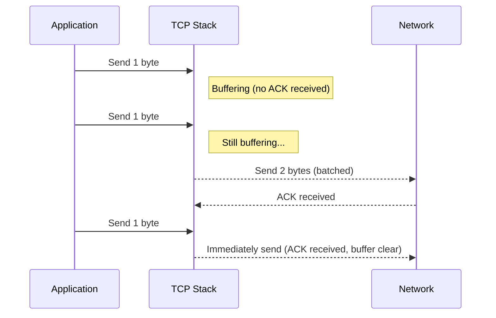

# Low-Level Network Optimizations: Socket Options That Matter

Socket settings can limit both throughput and latency when the system is under load. The defaults are designed for safety and compatibility, not for any particular workload. In practice they often become the bottleneck before CPU or memory do. Go lets you reach the underlying file descriptors through `syscall`, so you can change key socket options without giving up its concurrency model or the standard library.

## Disabling Nagle’s Algorithm: `TCP_NODELAY`

Nagle’s algorithm exists to make TCP more efficient. Every tiny packet you send carries headers that add up to a lot of wasted bandwidth if left unchecked. Nagle fixes that by holding back small writes until it can batch them into a full segment, cutting down on overhead and network chatter. That trade-off — bandwidth at the expense of latency — is usually fine, which is why it’s on by default. But if your application sends lots of small, time-critical messages, like a game server or a trading system, waiting even a few milliseconds for the buffer to fill can hurt.



Nagle’s algorithm trades latency for efficiency by holding back small packets until there’s more data to send or an acknowledgment comes back. That delay is fine for bulk transfers but a problem for anything that needs fast, small messages. Setting `TCP_NODELAY` turns it off so data goes out immediately. This is critical for workloads like gaming, trading, real-time video, and other interactive systems where you can’t afford to wait.

In Go, you can turn off Nagle’s algorithm with `TCP_NODELAY`:

```go
func SetTCPNoDelay(conn *net.TCPConn) error {
	return conn.SetNoDelay(true)
}
```

## SO\_REUSEPORT for Scalability

`SO_REUSEPORT` lets multiple sockets on the same machine bind to the same port and accept connections at the same time. Instead of funneling all incoming connections through one socket, the kernel distributes new connections across all of them, so each socket gets its own share of the load. This is useful when running several worker processes or threads that each accept connections independently, because it removes the need for user-space coordination and avoids contention on a single accept queue. It also makes better use of multiple CPU cores by letting each process or thread handle its own queue of connections directly.

Typical scenarios for `SO_REUSEPORT`:

* High-performance web servers where multiple worker processes call bind() on the same port. The kernel distributes incoming connection requests across the accept() queues of all bound sockets, typically using a hash of the 4-tuple or round-robin, eliminating the need for a user-space dispatcher.
* Multi-threaded or multi-process servers that accept connections in parallel. When combined with Go’s GOMAXPROCS, each thread or process can call accept() independently on its own file descriptor, avoiding lock contention on a single queue and fully utilizing all CPU cores.
* Fault-tolerant designs where multiple processes bind to the same port to increase resilience. If one process exits or is killed, the others continue to service connections without interruption, because each maintains its own independent accept() queue.

In Go, SO_REUSEPORT isn’t exposed in the standard library, but it can be set via syscall when creating the socket. This is done with `syscall.SetsockoptInt`, which operates on the socket’s file descriptor. You pass the protocol level (`SOL_SOCKET`), the option (`SO_REUSEPORT`), and the value (`1` to enable). This must happen before calling `bind()`, so it’s typically placed in the Control callback of a `net.ListenConfig`, which runs before the socket is bound.

```go
listenerConfig := &net.ListenConfig{
	Control: func(network, address string, c syscall.RawConn) error {
		return c.Control(func(fd uintptr) {
			syscall.SetsockoptInt(int(fd), syscall.SOL_SOCKET, syscall.SO_REUSEPORT, 1)
		})
	},
}
listener, err := listenerConfig.Listen(context.Background(), "tcp", ":8080")
```

## Tuning Socket Buffer Sizes: `SO_RCVBUF` and `SO_SNDBUF`

Socket buffer sizes — `SO_RCVBUF` for receiving and `SO_SNDBUF` for sending — directly affect throughput and the number of system calls. These buffers hold incoming and outgoing data in the kernel, smoothing out bursts and letting the application read and write at its own pace.

When buffers are too small, they fill up quickly and the kernel keeps waking the application to read or write data. That extra churn increases CPU usage and limits how much data you can push through the connection. If the buffers are too large, they just waste memory and let packets pile up in the queue longer than needed, which adds latency and hurts responsiveness when the system is busy. The point is to make the buffers big enough to keep the link busy but not so big that they turn into a backlog.

This is how you can adjust the buffer:


```go
func SetSocketBuffers(conn *net.TCPConn, recvBuf, sendBuf int) error {
	if err := conn.SetReadBuffer(recvBuf); err != nil {
		return err
	}
	return conn.SetWriteBuffer(sendBuf)
}
```

Typical default sizes for `SO_RCVBUF` and `SO_SNDBUF` on Linux systems range from 128 KB to 256 KB, depending on the kernel version and system configuration. These defaults are chosen to provide a balance between minimizing latency and avoiding excessive memory usage. For high-bandwidth applications or connections with high latency (e.g., long-haul TCP connections), increasing these buffer sizes—sometimes to several megabytes—can significantly improve throughput by allowing more in-flight data without blocking.

The right buffer size depends on the RTT, the link bandwidth, and the size of the messages your application sends. A common rule of thumb is to match the buffer to the bandwidth–delay product (BDP), which is just `bandwidth × RTT`. That way, the connection can keep the pipe full without stalling.

To figure out the right buffer sizes, you need to test under realistic load. Tools like iperf3 are good for measuring raw throughput, and app-specific profiling (pprof, netstat, custom metrics) helps spot where things actually get stuck. Increase the buffer sizes step by step during load tests and watch where the gains level off — that’s usually a good place to stop.

!!! warning
	The optimal settings depend on how your system actually runs, so you need to measure them under load. Guessing or copying values from elsewhere usually doesn’t work — you have to test and adjust until it performs the way you need.

## TCP Keepalives for Reliability

TCP keepalive probes detect dead peer connections, freeing resources promptly. Keepalives prevent hanging connections in long-lived services.

Default keepalive settings on most platforms are conservative—idle time of 2 hours, 10 probes at 75-second intervals—intended for general-purpose environments. For server-side applications requiring faster failure detection (e.g., reverse proxies, microservices over unreliable links), significantly more aggressive settings are common: 30 seconds idle, 3 probes at 10-second intervals.

However, aggressive tuning increases traffic and risks false positives on congested links. A recommended approach is to balance early detection and network conditions. Typical tuned values—idle 30–60s, interval 10–15s, probes 3–5—are not specified by any RFC or standard, but come from operational practice and vendor guidance. For example, PostgreSQL, Kubernetes, and AWS all recommend values in this range to align with cloud load balancer timeouts and service SLAs. These numbers are derived from empirical experience to minimize both false positives and long detection delays, as discussed in sources like PostgreSQL documentation, AWS networking blogs, and Kubernetes issue discussions.

These can be adjusted system-wide using `sysctl` or per-connection on some platforms (e.g., Linux) via platform-specific socket options or libraries that expose `TCP_KEEPIDLE`, `TCP_KEEPINTVL`, and `TCP_KEEPCNT`. In Go, `SetKeepAlivePeriod` only controls the idle time; deeper tuning may require cgo or raw syscalls.

In Go, enabling and tuning keepalives:

```go
func SetKeepAlive(conn *net.TCPConn, idleTime time.Duration) error {
	if err := conn.SetKeepAlive(true); err != nil {
		return err
	}
	return conn.SetKeepAlivePeriod(idleTime)
}
```

The `SetKeepAlivePeriod` method in Go controls only the idle time before the first keepalive probe is sent. On Linux, this corresponds to the `TCP_KEEPIDLE` parameter; on macOS and BSD, it maps to `TCP_KEEPALIVE`. However, it does not affect the interval between subsequent probes (`TCP_KEEPINTVL`) or the number of allowed failed probes (`TCP_KEEPCNT`). These two must be set separately using raw syscalls or cgo bindings if finer-grained control is required. Without tuning `KEEPINTVL` and `KEEPCNT`, a dead connection may take several minutes to detect, even if `SetKeepAlivePeriod` is low.

!!! warning
	Do not change the default values without testing them properly. The right settings depend entirely on your workload, the network path, and how the application behaves under real conditions. Different configurations can produce very different results, and what works elsewhere might hurt here. You’ll find plenty of blog posts and advice with suggested numbers, but those are just starting points. The only reliable way to figure out what works in your environment is to test and measure it yourself.

## Connection Backlog: SOMAXCONN

The connection backlog (`SOMAXCONN`) defines how many pending connections can queue up for acceptance. When the backlog queue fills up, additional connection attempts are refused by the kernel (usually resulting in `ECONNREFUSED`(1) or dropped SYN packets) until space becomes available, which can cause clients to see connection errors under heavy load.
{ .annotate }

1. A `connect()` on a stream socket found no one listening on the remote address. See Linux [man pages](https://man7.org/linux/man-pages/man2/connect.2.html) for more details.

The default value of `SOMAXCONN` on Linux is typically 128 or 4096, depending on the kernel version and distribution. These defaults are chosen to strike a balance between memory use and handling normal connection rates, but they may be too low for high-traffic servers or services experiencing connection bursts.

A bigger backlog helps when the server gets hit with a burst of connections — like after a failover or during peak — so clients don’t get dropped right away. Raising `SOMAXCONN` lets the kernel queue more connections while the app catches up and keeps the service reachable under load.

Changing `SOMAXCONN` is a system-level setting. On Linux you usually adjust it through kernel parameters.

```bash
# System-level setting
sysctl -w net.core.somaxconn=4096
```

## Safely Wrapping Syscalls in Go

Working with socket options through syscalls means dealing directly with file descriptors. These calls need to happen before the socket is bound or used, which makes the timing important and easy to get wrong. If you set an option too late, the kernel ignores it, or worse, you get hard-to-reproduce bugs. Since you’re bypassing the Go runtime, you’re also responsible for checking errors and making sure the file descriptor stays in a valid state. `syscall.RawConn` exists to help with this — it gives you a controlled hook to run your code against the socket at exactly the right point during setup.

```go
listenerConfig := net.ListenConfig{
	Control: func(network, address string, c syscall.RawConn) error {
		return c.Control(func(fd uintptr) {
			// Custom syscall here; safely handled means it executes within the correct context,
			// before the socket is handed over to the Go runtime, with proper error checking and synchronization
		})
	},
}
```

The socket options are set during creation, at the right time, and in one place. That keeps them from being forgotten or misapplied later.

## Real-World Considerations

Tuning sockets is always a trade-off — lower latency, higher throughput, better reliability, and reasonable resource use don’t usually come together for free. You need to understand your workload, change one thing at a time, and test it under real load. Without monitoring and instrumentation, you’re just guessing, so measure everything and make sure the changes actually help.
