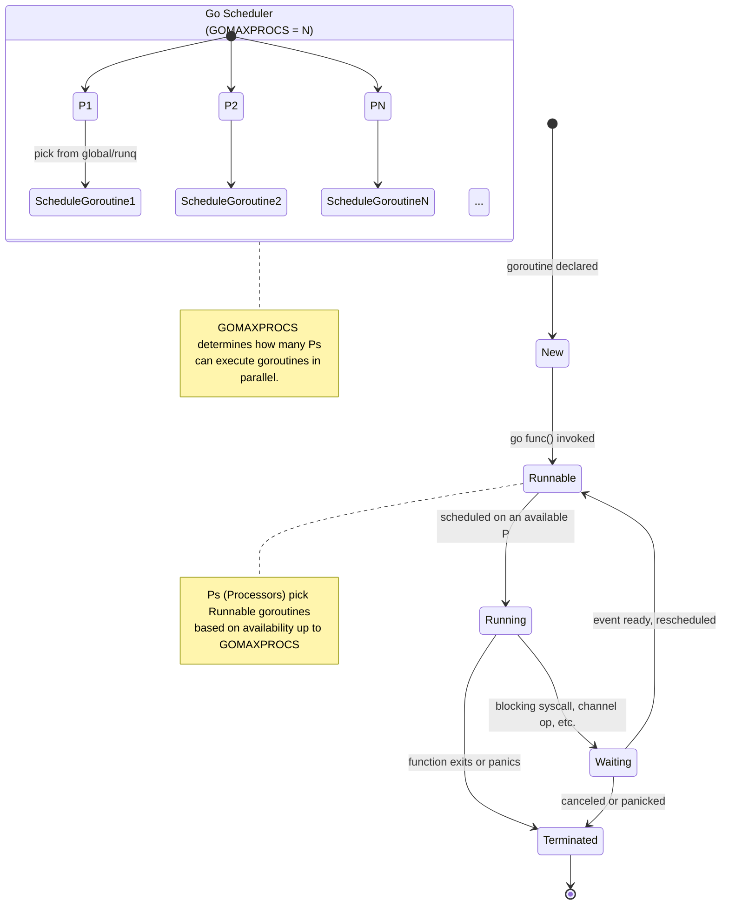
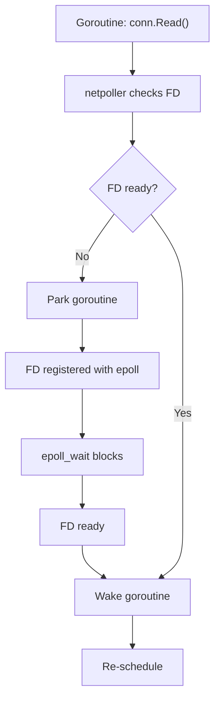
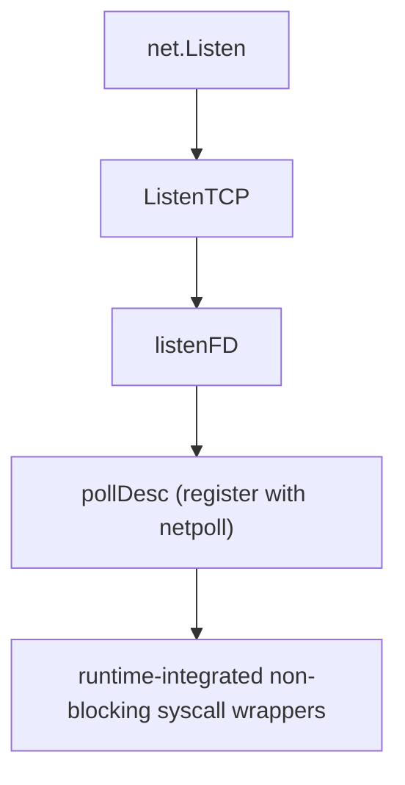
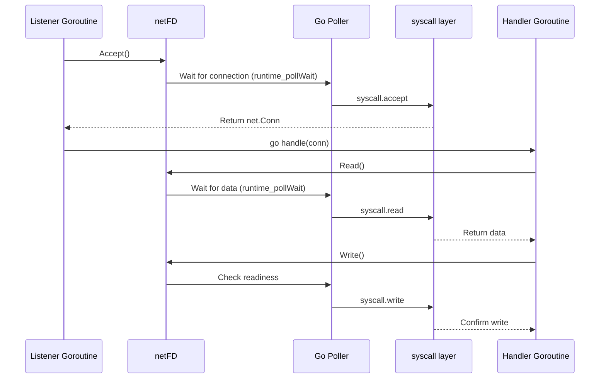

# Go Networking Internals

Go’s networking model is deceptively simple on the surface—spawn a goroutine, accept a connection, read from it, and write a response. But behind this apparent ease is a highly optimized and finely tuned runtime that handles tens or hundreds of thousands of connections with minimal OS overhead. In this deep dive, we’ll walk through the mechanisms that make this possible: from goroutines and the scheduler to how Go interacts with OS-level pollers like `epoll`, `kqueue`, and IOCP.

## Goroutines and the Runtime Scheduler

Goroutines are lightweight user-space threads managed by the Go runtime. They’re cheap to create (a few kilobytes of stack) and can scale to millions. But they’re not magic—they rely on the runtime scheduler to multiplex execution across a limited number of OS threads.

Go’s scheduler is based on an M:N model:

- **M (Machine)**: Represents an OS thread.
- **G (Goroutine)**: Represents the actual task or coroutine.
- **P (Processor)**: Represents the context for scheduling (holding run queues, caches).

Each P can execute one G at a time using an M. There are as many Ps as GOMAXPROCS. If a goroutine blocks on I/O, another runnable G may park and reuse the thread.



## Blocking I/O in Goroutines: What Really Happens?

Suppose a goroutine calls `conn.Read()`. This *looks* blocking—but only from the goroutine's perspective. Internally, Go’s runtime intercepts the call and uses a mechanism known as the [netpoller](https://go.dev/src/runtime/netpoll.go).

On Unix-based systems, Go uses readiness-based polling (`epoll` on Linux, `kqueue` on macOS/BSD). When a goroutine performs a syscall like `read(fd)`, the runtime checks whether the file descriptor is ready. If not:

1. The goroutine is parked.
2. The file descriptor is registered with the poller.
3. The OS thread is released to run other work.
4. When the fd becomes ready, the poller wakes up, and the runtime marks the goroutine as runnable.



This system enables Go to serve a massive number of clients concurrently, using a small number of threads, avoiding the overhead of traditional thread-per-connection models.

## Internals of the `net` Package

Let’s take a look at what happens behind `net.Listen("tcp", ":8080")` and `conn.Read()`.

- `net.Listen` calls into `net.ListenTCP`, which constructs a `netFD` struct wrapping the socket.
- The socket is marked non-blocking via `syscall.SetNonblock(fd, true)`.
- `Accept` and `Read` methods on `netFD` are layered on top of syscalls, but routed through internal pollers and wrapped with logic to yield and resume goroutines.

Here’s a rough diagram of the call chain:



This architecture makes the blocking calls from the developer’s perspective translate into non-blocking interactions with the kernel.

## The Netpoller: Polling with Epoll/Kqueue/IOCP

The **netpoller** is a runtime subsystem that integrates low-level polling mechanisms with Go’s scheduling system. Each fd has an associated `pollDesc`, which helps coordinate goroutine suspension and resumption.

The poller operates in a dedicated thread (or threads) that loop over OS wait primitives:

- [epoll_wait](https://man7.org/linux/man-pages/man2/epoll_wait.2.html) (Linux)
- [kqueue](https://en.wikipedia.org/wiki/Kqueue) (macOS/BSD)
- [IOCP](https://learn.microsoft.com/en-gb/windows/win32/fileio/i-o-completion-ports) (Windows)

When an I/O event fires, the poller finds the associated `pollDesc`, identifies the parked goroutine, and puts it back into the run queue.

In the Go source, relevant files include:

- [runtime/netpoll_epoll.go](https://go.dev/src/runtime/netpoll_epoll.go)
- [runtime/netpoll_kqueue.go](https://go.dev/src/runtime/netpoll_kqueue.go)
- [runtime/netpoll_windows.go](https://go.dev/src/runtime/netpoll_windows.go)

The Go poller is readiness-based (not completion-based, except for Windows IOCP). It handles:

- fd registration
- waking goroutines on readiness
- integration with the run queue (P-local or global)

## Example: High-Performance TCP Echo Server

Let's break down a simple Go TCP echo server and map each part to Go’s internal networking and scheduling mechanisms — including `netFD`, `poll.FD`, and goroutines.

??? example "Simple Echo server source code"
    ```go
    
    ```

### Imports and Setup

```go
import (
    "bufio"
    "fmt"
    "net"
    "time"
    "sync/atomic"
)
```

**Internals Involved**:

- The `net` package abstracts system-level networking.
- Under the hood:
    - Uses `netFD` (internal, private struct)
    - Wraps `poll.FD` for non-blocking I/O
    - Uses OS features like `epoll`, `kqueue`, or `IOCP` for event notification

### Listener Setup

```go
listener, err := net.Listen("tcp", ":9000")
if err != nil {
    panic(err)
}
fmt.Println("Echo server listening on :9000")
```

**Internals Involved**:

- `net.Listen()` returns a `TCPListener`
    - Internally calls `syscall.socket`, `bind`, `listen`
    - Associates a `netFD` with the socket
- The listener uses Go’s internal poller to enable non-blocking `Accept`

### Accept Loop and Goroutine Scheduling

```go
for {
    conn, err := listener.Accept()
    if err != nil {
        fmt.Printf("Accept error: %v\n", err)
        continue
    }
    go handle(conn)
}
```

**Internals Involved**:

- `listener.Accept()` → `netFD.Accept()` → `poll.FD.Accept()` → `syscall.accept`
      - Non-blocking, waits via Go's poller (`runtime_pollWait`)
- `go handle(conn)` spawns a **goroutine (G)**
      - Scheduled onto a **P** (Processor)
      - `P` is part of Go’s M:N scheduler governed by `GOMAXPROCS`

### Connection Handler

```go
func handle(conn net.Conn) {
    defer conn.Close()

    reader := bufio.NewReader(conn)

    for {
        conn.SetReadDeadline(time.Now().Add(5 * 60 * time.Second))

        line, err := reader.ReadString('\n')
        if err != nil {
            fmt.Printf("Connection closed: %v\n", err)
            return
        }

        _, err = conn.Write([]byte(line))
        if err != nil {
            fmt.Printf("Write error: %v\n", err)
            return
        }
    }
}
```

**Internals Involved**:

- `bufio.NewReader(conn)` wraps the `net.Conn`, which is backed by `*TCPConn` and `netFD`.
- `ReadString()` calls `conn.Read()` under the hood:
      - `netFD.Read()` → `poll.FD.Read()` → `syscall.Read()`
      - Uses `runtime_pollWait` to yield the goroutine if data isn't ready
- `SetReadDeadline` sets a timeout by integrating with the runtime's network poller to prevent indefinite blocking.
- `conn.Write()` → `netFD.Write()` → `poll.FD.Write()` → `syscall.write`

### Internal Flow Diagram



This model scales well as long as you:

- Ensure your `ulimit -n` is high enough
- Avoid shared state and contention
- Tune your GOMAXPROCS for your workload

## Observations at Scale

As connections scale up ([see how it may look like here](gc-endpoint-profiling.md)):

- Per-connection memory and GC pressure grow
- Frequent goroutine context switching may introduce latency
- Coordinating channels, timeouts, and backpressure adds complexity

Some mitigation strategies:

- Use `sync.Pool` for buffer reuse
- Minimize GC pauses (avoid per-request allocations)
- Prefer `netpoll`-friendly designs (avoid long CPU-bound goroutines)

---

Go’s model trades OS-level multiplexing for user-space scheduling and event-driven I/O coordination. It’s not a silver bullet—but when used correctly, it offers a robust platform for building scalable network services. Understanding these internals helps you avoid common traps, optimize at the right layer, and build systems that behave predictably under load.