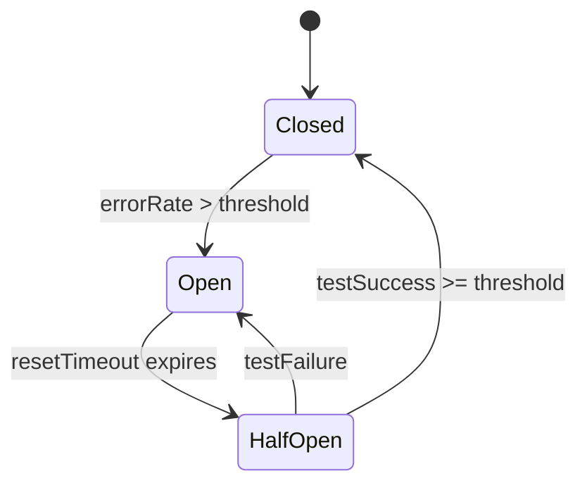
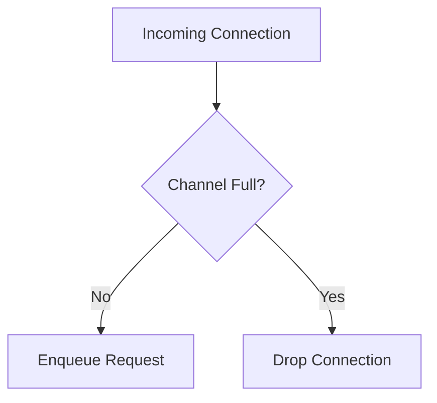
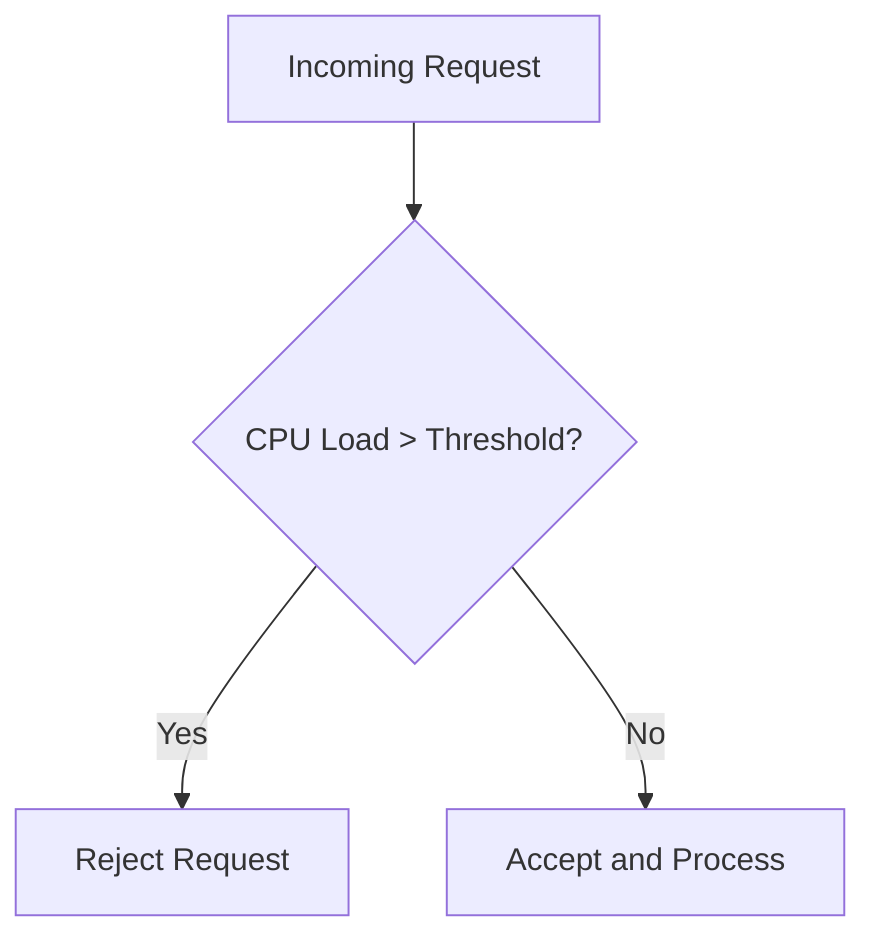
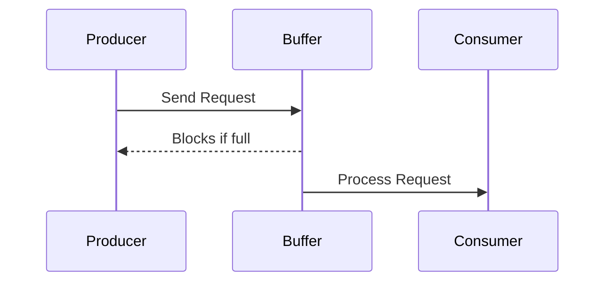
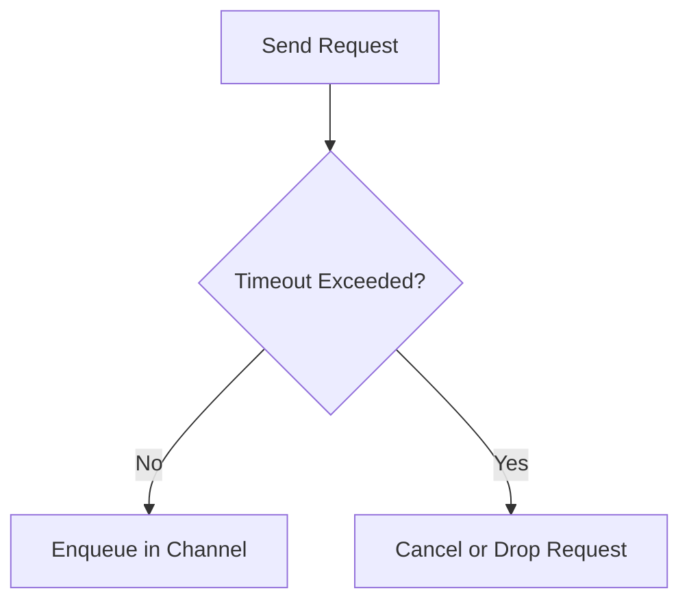
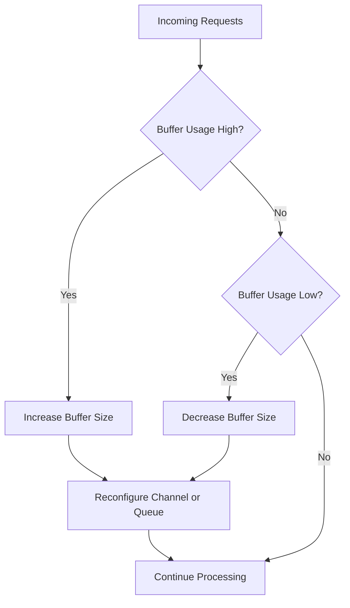
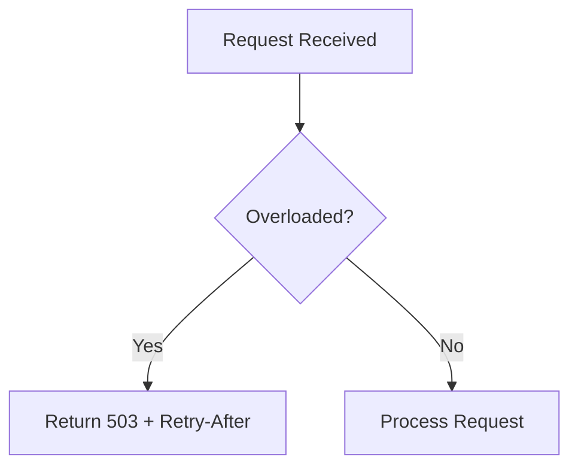
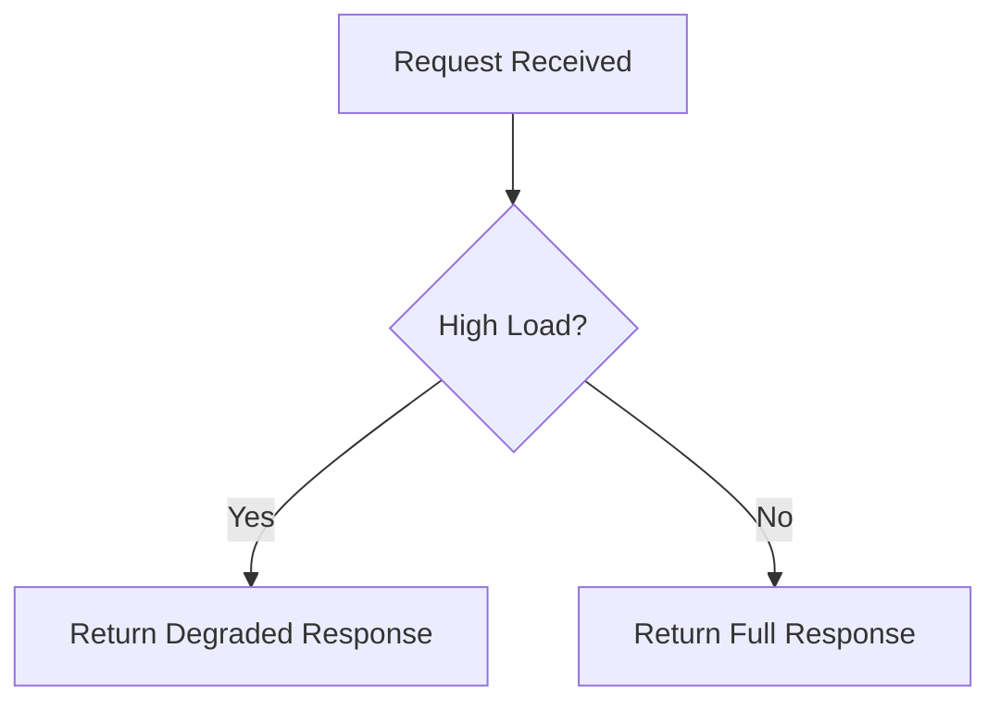

# Building Resilient Connection Handling with Load Shedding and Backpressure

In high-throughput services, connection floods and sudden spikes can saturate resources, leading to latency spikes or complete system collapse. This article dives into the low-level mechanisms—circuit breakers, load shedding (passive and active), backpressure via channel buffering and timeouts—and shows how to degrade or reject requests gracefully when pressure mounts.

## Circuit Breakers: Failure Isolation

Circuit breakers guard downstream dependencies by short‑circuiting calls when error rates or latencies exceed thresholds. Without them, a slow or failing service causes client goroutines to pile up, consuming all threads or connections and triggering cascading failure. This mechanism isolates failing services, preventing them from affecting the overall system stability. A circuit breaker continuously monitors response times and error rates, intelligently managing request flow and allowing the system to adapt to changing conditions automatically.

### What It Does

A circuit breaker maintains three states:

- **Closed**: Requests flow through. Failures are counted over a rolling window.
- **Open**: Calls immediately return an error; no requests go to the target.
- **Half-Open**: A limited number of test requests are allowed; success transitions back to Closed, failure re-opens.



### Why It Matters

Without circuit breakers, services depending on slow or failing components will eventually experience thread exhaustion, request queue buildup, and degraded tail latencies. Circuit breakers introduce bounded failure response by proactively rejecting requests once a dependency is known to be unstable. This reduces the impact surface of a single failure and increases system recoverability. During the Half-Open phase, only limited traffic probes the system, minimizing the risk of amplifying an unstable recovery. Circuit breakers are especially critical in distributed systems where fault domains span across network and service boundaries. They also serve as a feedback mechanism, signaling operational anomalies without requiring centralized alerting.

### Implementation Sketch

There are many ways to implement a Circuit Breaker, each varying in complexity and precision. Some designs use fixed time windows, others rely on exponential backoff, or combine error rates with latency thresholds. In this article, we’ll focus on a simple, practical approach: a sliding window with discrete time buckets for failure tracking, combined with a straightforward three-state machine to control call flow and recovery.

??? example "The Sketch"
    ```mermaid
    flowchart TD
    subgraph SlidingWindow ["Sliding Window (last N intervals)"]
        B0((Bucket 0))
        B1((Bucket 1))
        B2((Bucket 2))
        B3((Bucket 3))
        B4((Bucket 4))
    end

    B0 -.-> Tick1["Tick(): move idx + reset bucket"]
    Tick1 --> B1
    B1 -.-> Tick2["Tick()"]
    Tick2 --> B2
    B2 -.-> Tick3["Tick()"]
    Tick3 --> B3
    B3 -.-> Tick4["Tick()"]
    Tick4 --> B4
    B4 -.-> Tick5["Tick()"]
    Tick5 --> B0

    B0 -.-> SumFailures["Sum all failures"]

    SumFailures -->|Failures >= errorThreshold| OpenCircuit["Circuit Opens"]

    OpenCircuit --> WaitReset["Wait resetTimeout"]
    WaitReset --> HalfOpen["Move to Half-Open state"]

    subgraph HalfOpenPhase ["Half-Open Phase"]
        TryCall1("Try Call 1")
        TryCall2("Try Call 2")
        TryCall3("Try Call 3")
    end

    HalfOpen --> SuccessCheck["Check Successes"]
    SuccessCheck -->|Enough successes| CloseCircuit["Circuit Closes"]
    SuccessCheck -->|Failure during trial| ReopenCircuit["Circuit Re-Opens"]

    ReopenCircuit --> WaitReset
    ```

    First, we need a lightweight way to track how many failures have occurred recently. Instead of maintaining an unbounded history, we use a sliding window with fixed-size time buckets:

    ```go
    type slidingWindow struct {
        buckets []int32
        size    int
        idx     int
        mu      sync.Mutex
    }
    ```

    Each bucket counts events for a short time slice. As time moves forward, we rotate to the next bucket and reset it, ensuring old data naturally fades away. Here's the core movement logic:

    ```go
    func (w *slidingWindow) Tick() {
        w.mu.Lock()
        defer w.mu.Unlock()
        w.idx = (w.idx + 1) % w.size
        atomic.StoreInt32(&w.buckets[w.idx], 0)
    }
    ```

    Summing across all buckets gives us the rolling view of recent failures.

    Rather than scattering magic numbers like 0, 1, and 2 across the codebase, we introduce named states using Go's `iota`:

    ```go
    type CircuitState int32

    const (
        StateClosed CircuitState = iota
        StateOpen
        StateHalfOpen
    )
    ```

    Each state represents a clear behavior: in `Closed`, calls flow normally; in `Open`, calls are blocked to protect the system; in `Half-Open`, limited trial calls are allowed.

    The `CircuitBreaker` struct ties everything together, holding the sliding window, state, thresholds, and counters for tracking in-flight operations:

    ```go
    type CircuitBreaker struct {
        failures              *slidingWindow
        errorThresh           int
        successThresh         int32
        interval              time.Duration
        resetTimeout          time.Duration
        halfOpenMaxConcurrent int32

        state          CircuitState
        lastOpen       time.Time
        successes      int32
        inFlightTrials int32
    }
    ```

    Initialization includes kicking off a background ticker to advance the sliding window:

    ```go
    func NewCircuitBreaker(errThresh int, succThresh int, interval, reset time.Duration, halfOpenMax int32) *CircuitBreaker {
        cb := &CircuitBreaker{
            failures:              newWindow(60),
            errorThresh:           errThresh,
            successThresh:         int32(succThresh),
            interval:              interval,
            resetTimeout:          reset,
            halfOpenMaxConcurrent: halfOpenMax,
        }
        go func() {
            ticker := time.NewTicker(interval)
            for range ticker.C {
                cb.failures.Tick()
            }
        }()
        return cb
    }
    ```

    The `Allow()` method decides whether an incoming call should proceed:

    ```go
    func (cb *CircuitBreaker) Allow() bool {
        switch atomic.LoadInt32((*int32)(&cb.state)) {
        case int32(StateClosed):
            return true
        case int32(StateOpen):
            if time.Since(cb.lastOpen) >= cb.resetTimeout {
                atomic.StoreInt32((*int32)(&cb.state), int32(StateHalfOpen))
                atomic.StoreInt32(&cb.successes, 0)
                atomic.StoreInt32(&cb.inFlightTrials, 0)
                return true
            }
            return false
        case int32(StateHalfOpen):
            if atomic.LoadInt32(&cb.inFlightTrials) >= cb.halfOpenMaxConcurrent {
                return false
            }
            atomic.AddInt32(&cb.inFlightTrials, 1)
            return true
        }
        return true
    }
    ```

    This ensures that after an open timeout, only a controlled number of trial requests are permitted.

    After each call, we report its outcome so the breaker can adjust:

    ```go
    func (cb *CircuitBreaker) Report(success bool) {
        if !cb.Allow() {
            return
        }
        defer func() {
            if atomic.LoadInt32((*int32)(&cb.state)) == int32(StateHalfOpen) {
                atomic.AddInt32(&cb.inFlightTrials, -1)
            }
        }()

        switch atomic.LoadInt32((*int32)(&cb.state)) {
        case int32(StateClosed):
            if !success {
                cb.failures.Inc()
                if int(cb.failures.Sum()) >= cb.errorThresh {
                    atomic.StoreInt32((*int32)(&cb.state), int32(StateOpen))
                    cb.lastOpen = time.Now()
                }
            }

        case int32(StateHalfOpen):
            if success {
                if atomic.AddInt32(&cb.successes, 1) >= cb.successThresh {
                    atomic.StoreInt32((*int32)(&cb.state), int32(StateClosed))
                }
            } else {
                atomic.StoreInt32((*int32)(&cb.state), int32(StateOpen))
                cb.lastOpen = time.Now()
            }
        }
    }
    ```

    Failures during normal operation cause the circuit to Open. Successes during Half-Open gradually rebuild trust, closing the circuit when enough healthy calls succeed.

    Putting it all together:

    ```go
    breaker := NewCircuitBreaker(
        10,              // open after 10 failures
        5,               // close after 5 half-open successes
        time.Second,     // tick every second
        10*time.Second,  // remain open for 10 seconds
        3,               // allow up to 3 trial calls
    )

    if breaker.Allow() {
        success := callRemoteService()
        breaker.Report(success)
    }
    ```

    This approach protects systems under distress, recovers cautiously, and maintains throughput where possible.


## Load Shedding: Passive vs Active

Load shedding refers to the practice of shedding, or dropping, excess load in order to protect system integrity. It becomes a necessity when demand exceeds the sustainable capacity of a service, particularly under conditions of degraded performance or partial failure. By rejecting less important work, a system can focus on fulfilling critical requests and maintaining stability. Load shedding can be implemented either *passively—relying* on queues and resource limits—or *actively—based* on observed performance metrics. The balance between these two methods determines the trade-off between simplicity, responsiveness, and accuracy in overload scenarios.

### Passive Load Shedding

Passive load shedding is a minimalistic but highly effective mechanism that relies on the natural limits of bounded queues to regulate request flow. When a bounded buffer or channel reaches its capacity, any additional incoming request is either blocked or dropped. This approach places no computational overhead on the system and doesn't require runtime telemetry or complex decision-making logic. It serves as a coarse-grained, first-line defense against unbounded load by defining strict queue limits and enforcing backpressure implicitly. Passive shedding is particularly suitable for latency-sensitive systems that prefer quick rejection over queue buildup.



??? example "The Sketch"
    In this implementation, we use a buffered channel to introduce a hard upper limit on how many requests the system will queue for processing. When new connections arrive, they are either enqueued immediately if there’s available buffer space, or dropped without processing if the channel is full.
    This style of passive load shedding is simple, deterministic, and highly effective for services where it is better to reject excess load early rather than risk cascading failures deeper inside the system. It provides a natural form of admission control without adding complex queuing, retries, or explicit rejection signaling.
    ```go
    // A buffered channel of size N implements passive load shedding.
    // When full, new requests are silently dropped (connection closed).
    requests := make(chan *Request, 1000)

    // acceptLoop continuously accepts new connections and enqueues them
    // if there is capacity; otherwise, it drops excess load immediately.
    func acceptLoop(ln net.Listener) {
        for {
            conn, err := ln.Accept()
            if err != nil {
                continue // transient accept error, skip
            }
            req := &Request{conn: conn}

            select {
            case requests <- req:
                // Request accepted and queued for processing.
            default:
                // Channel full: drop request immediately to avoid overload.
                conn.Close()
            }
        }
    }
    ```

#### Why It Matters

Passive load shedding leverages natural constraints in bounded resources to apply backpressure at the system edges. When queues are full, rejecting new work avoids exacerbating downstream bottlenecks or amplifying queuing delays. This method is low-overhead and deterministic—services either have space to process or reject immediately. However, it lacks sensitivity to CPU or memory pressure, making it best suited as a safety valve rather than a comprehensive control strategy. Passive shedding also plays a key role in fail-fast systems where speed of rejection is preferable to prolonged degradation. It simplifies overload protection without external observability dependencies.

### Active Load Shedding

Active load shedding introduces a higher degree of intelligence and responsiveness by integrating system telemetry—such as CPU load, memory usage, request latencies, or custom business KPIs—into the decision-making process. Rather than reacting only when queues overflow, active shedding proactively evaluates system health and begins dropping or deferring traffic based on dynamic thresholds. This allows services to stay ahead of resource exhaustion, make more fine-grained decisions, and prioritize critical workloads. Active shedding is more computationally expensive and complex than passive techniques, but offers higher precision and adaptability, especially in bursty or unpredictable environments.



??? example "The Sketch"
    In this design, active load shedding is driven by real-time system metrics — specifically CPU usage.
    The shedder object monitors CPU load at a regular interval and flips a global shedding flag when the load exceeds a defined threshold.
    When the flag is active, new incoming connections are proactively rejected, even if the internal queues could technically still accept them.
    This approach allows the system to respond dynamically to environmental pressure, rather than passively waiting for internal backlogs to accumulate.
    It’s particularly effective for services where CPU saturation is a leading indicator of imminent degradation.

    ```go
    // shedder monitors system CPU load and decides whether to shed incoming requests.
    type shedder struct {
        maxCPU    float64        // CPU usage threshold to start shedding
        checkFreq time.Duration  // frequency to check CPU load
    }

    // ShouldShed checks current CPU usage against the configured maximum.
    func (s *shedder) ShouldShed() bool {
        cpu := getCPULoad()
        return cpu > s.maxCPU
    }

    // startMonitor periodically evaluates CPU load and updates the global shedding flag.
    func (s *shedder) startMonitor() {
        ticker := time.NewTicker(s.checkFreq)
        for range ticker.C {
            if s.ShouldShed() {
                atomic.StoreInt32(&shedding, 1) // enter shedding mode
            } else {
                atomic.StoreInt32(&shedding, 0) // exit shedding mode
            }
        }
    }

    // During request acceptance, the shedding flag is checked to actively reject overload.
    if atomic.LoadInt32(&shedding) == 1 {
        conn.Close() // actively reject new connection
    } else {
        enqueue(conn) // accept and process normally
    }
    ```

#### Why It Matters

Active shedding enables services to respond to nuanced overload conditions by inspecting real-time system health signals. Unlike passive strategies, it doesn't wait for queues to overflow but anticipates risk based on dynamic telemetry. This leads to earlier rejection and more graceful degradation. Because it incorporates CPU usage, latency, and error rate into decision logic, active shedding is especially effective in CPU-bound workloads or mixed-load services. However, it requires careful calibration to avoid false positives and oscillation. When tuned properly, active shedding reduces latency tail spikes and increases overall system fairness under contention.

## Backpressure Strategies

Backpressure is a fundamental control mechanism in concurrent systems that prevents fast producers from overwhelming slower consumers. By imposing limits on how much work can be queued or in-flight, backpressure ensures that system throughput remains stable and predictable. It acts as a contract between producers and consumers: "only send more when there's capacity to handle it." Effective backpressure strategies protect both local and remote components from runaway memory growth, scheduling contention, and thrashing. In Go, backpressure is often implemented using buffered channels, context cancellation, and timeouts, each offering a different degree of strictness and complexity.

### Buffered Channel Backpressure

Buffered channels are the most direct form of backpressure in Go. They provide a queue with fixed capacity that blocks the sender once full, naturally throttling the producer to match the consumer's pace. This backpressure is enforced by the Go runtime without requiring additional logic, making it a convenient choice for simple pipelines and high-throughput services. Properly sizing the channel is essential to balance throughput and latency: too small leads to frequent stalls; too large risks uneven latency and poor garbage collection performance. Buffered channels are best used when traffic volume is consistent and processing times are predictable.



??? example "The Sketch"
    In this model, a buffered channel acts as a natural backpressure mechanism. Producers (in this case, connection handlers) push requests into the requests channel. As long as there’s available buffer space, enqueueing is non-blocking and fast. However, once the channel fills up, the producer blocks automatically until a consumer reads from the channel and frees up space.
    This design elegantly slows down intake when processing can’t keep up, preventing memory bloat or CPU exhaustion without requiring explicit shedding logic.

    ```go
    // requests is a buffered channel that provides natural backpressure.
    // When full, producers block until space becomes available.
    requests := make(chan *Request, 500)

    // Producer loop reads incoming connections and enqueues them.
    // Blocks automatically when the channel is full, applying backpressure upstream.
    for conn := range incomingConns {
        req := &Request{conn: conn}
        requests <- req // blocks when buffer reaches 500
    }
    ```

#### Why It Matters

Buffered channels enforce backpressure at the point of communication, ensuring that a producer cannot outpace the consumer beyond a predefined capacity. This prevents unbounded memory growth and protects downstream systems from congestion collapse. When the buffer is full, producers block until space becomes available, creating a natural throttling mechanism that requires no coordination protocol or central scheduler. This behavior aligns producer throughput with consumer availability, smoothing bursts and avoiding CPU starvation caused by unbounded goroutine creation. Moreover, because this mechanism is handled by the Go runtime, it adds minimal overhead and is easy to reason about in concurrent pipelines. However, incorrect buffer sizing can lead to head-of-line blocking, increased latency jitter, or premature rejection upstream, so sizing decisions must be based on empirical throughput metrics and latency tolerance.

### Timeouts and Context Cancellation

Context cancellation and timeouts allow developers to specify explicit upper bounds on how long operations should block or wait. In overload conditions, timeouts prevent indefinite contention for shared resources and help preserve service-level objectives (SLOs) by bounding tail latencies. By layering timeout-based logic onto blocking calls, services can fail early when overwhelmed and avoid accumulating stale work. Context propagation also enables coordinated deadline enforcement across distributed systems, ensuring that latency targets are respected end-to-end. This method is particularly effective in systems with real-time constraints or those requiring precise error handling under partial failure.



??? example "The Sketch"
    In this approach, timeouts and context cancellation are used to bound how long a request can wait to enter the system. If the requests channel is immediately ready, the request is accepted and queued for processing.  If the channel remains full beyond the timeout (50 milliseconds in this case), the context fires, and the request is dropped explicitly by closing the underlying connection. This technique ensures that no request waits indefinitely, giving the system tight control over tail latencies and preventing hidden buildup under load.

    ```go
    // Set up a context with a strict timeout to bound enqueue latency.
    ctx, cancel := context.WithTimeout(context.Background(), 50*time.Millisecond)
    defer cancel()

    // Attempt to enqueue the request with timeout protection.
    select {
    case requests <- req:
        // Request accepted into the processing queue.
    case <-ctx.Done():
        // Timeout exceeded before enqueue succeeded; drop or fallback.
        req.conn.Close()
    }
    ```

    The choice of timeout duration (e.g., 50ms vs 200ms) has a significant impact on system behavior under load.

    * **Shorter timeouts** (like 50ms) favor fairness — ensuring that no single request hogs system resources while waiting.
    This helps the system reject overload quickly and keeps end-to-end latency predictable, but it can slightly reduce overall throughput if temporary congestion is frequent.
    * **Longer timeouts** (like 200ms) favor throughput — allowing temporary spikes in load to be absorbed if downstream recovery is fast enough.
    However, longer waits can increase tail latencies, cause uneven request handling, and potentially exhaust resources during sustained overload.

    Tuning the timeout is a tradeoff between protecting system responsiveness versus maximizing work completion rate.
    For most high-volume services, shorter timeouts combined with passive load shedding typically lead to better stability and user experience.

#### Why It Matters

Timeouts and context cancellation provide deterministic bounds on request lifecycle and system resource usage, which are essential in high-concurrency environments. Without these constraints, blocked operations can accumulate, leading to goroutine leaks, memory exhaustion, or increased tail latency as contention builds up. Timeouts allow systems to discard stale work that is unlikely to succeed within acceptable SLA thresholds, preserving responsiveness under load. Context cancellation enables hierarchical deadline propagation across service boundaries, ensuring consistent behavior and simplifying distributed timeout management. Additionally, early termination of blocked operations improves throughput under saturation by allowing retry-capable clients to shift load to healthier replicas or degrade gracefully. This pattern is critical in environments with strict latency objectives or dynamic load patterns, where predictable failure is preferable to delayed or non-deterministic success.

### Dynamic Buffer Sizing

Dynamic buffer sizing adds elasticity to the backpressure model, allowing services to adapt their buffering capacity to current load conditions. This approach is valuable in workloads that exhibit high variability or in systems that must handle periodic bursts without shedding. Implementations often rely on resizable queues or buffer pools, sometimes coordinated with autoscaling signals or performance feedback loops. Although more complex than fixed-size buffers, dynamic sizing can reduce latency spikes and resource contention by matching capacity to demand more closely. Careful concurrency management and race-avoidance techniques are essential to maintain safety in dynamic resizing logic.



??? example "The Sketch"
    In this model, the system keeps a tight feedback loop between workload intensity and resource provisioning.
    If the incoming request rate overwhelms the buffer (for example, reaching over 80% usage), the buffer automatically grows — doubling its capacity up to a maximum ceiling. On the other hand, if demand drops and the buffer remains underutilized (say below 20%), it shrinks conservatively to free memory.

    This technique is especially valuable in environments where traffic patterns are unpredictable — giving your service better burst tolerance without permanently oversizing infrastructure.

    Because resizing operations involve draining and recreating channels, all access is safely guarded with a mutex (mu) to avoid data races or inconsistency between producers and consumers.

    ```go
    // DynamicBuffer wraps a buffered channel and automatically resizes it
    // based on usage thresholds. This enables better elasticity under varying load.
    type DynamicBuffer struct {
        mu        sync.Mutex
        ch        chan Request     // underlying buffered channel
        minSize   int              // minimum buffer capacity
        maxSize   int              // maximum buffer capacity
        growPct   float64          // grow if usage exceeds this fraction
        shrinkPct float64          // shrink if usage falls below this fraction
    }

    // NewDynamicBuffer initializes a dynamic buffer with initial capacity and growth rules.
    // It also starts a background monitor that periodically evaluates whether resizing is needed.
    func NewDynamicBuffer(initial, min, max int, growPct, shrinkPct float64) *DynamicBuffer {
        db := &DynamicBuffer{
            ch:        make(chan Request, initial),
            minSize:   min,
            maxSize:   max,
            growPct:   growPct,
            shrinkPct: shrinkPct,
        }
        go db.monitor()
        return db
    }

    // Enqueue adds a request into the channel.
    // If the channel is full, this call blocks until space is available.
    func (db *DynamicBuffer) Enqueue(req Request) {
        db.mu.Lock()
        ch := db.ch
        db.mu.Unlock()

        ch <- req
    }

    // Dequeue retrieves a request from the channel or aborts if the context expires.
    // This ensures consumers can cancel work if needed without hanging indefinitely.
    func (db *DynamicBuffer) Dequeue(ctx context.Context) (Request, bool) {
        select {
        case req := <-db.ch:
            return req, true
        case <-ctx.Done():
            return Request{}, false
        }
    }

    // monitor runs periodically, evaluating the channel's fill ratio,
    // and triggers resizing if usage crosses configured thresholds.
    func (db *DynamicBuffer) monitor() {
        ticker := time.NewTicker(1 * time.Second)
        for range ticker.C {
            db.mu.Lock()

            oldCh := db.ch
            cap := cap(oldCh)
            length := len(oldCh)
            usage := float64(length) / float64(cap)

            var newSize int
            if usage > db.growPct && cap < db.maxSize {
                // If heavily loaded, double the buffer size, but cap it at maxSize
                newSize = min(db.maxSize, cap*2)
            } else if usage < db.shrinkPct && cap > db.minSize {
                // If lightly loaded, shrink the buffer to half, but not below minSize
                newSize = max(db.minSize, cap/2)
            }

            if newSize != 0 {
                // Create a new channel with the updated size and drain old requests into it
                newCh := make(chan Request, newSize)
                for len(oldCh) > 0 {
                    newCh <- <-oldCh
                }
                db.ch = newCh
            }

            db.mu.Unlock()
        }
    }
    ```

#### Why It Matters

Dynamic buffer sizing complements reactive backpressure with proactive adaptability. By tuning buffer capacity based on observed queue utilization, systems can respond early to sustained pressure without overcommitting memory or deferring rejection decisions until saturation. This elasticity helps smooth out latency spikes during transient load surges and prevents over-allocation during idle periods, preserving headroom for other critical components. Unlike fixed-size buffers that force developers to trade off between burst tolerance and memory efficiency, dynamically sized buffers evolve with workload shape—absorbing shocks without degrading steady-state performance. When integrated with metrics, autoscaling triggers, or performance-aware feedback loops, they become a foundational tool for achieving predictable behavior under unpredictable demand.

## Graceful Rejection and Degradation

Graceful rejection and degradation ensure that when overload conditions occur, the service doesn't simply fail but instead provides fallback behavior that preserves core functionality or communicates the system's status clearly to clients. These mechanisms are essential for maintaining user experience and system operability under stress. Rejection involves explicitly refusing to handle a request, often with guidance on when to retry, while degradation refers to reducing the scope or fidelity of a response. Together, they offer a layered resilience model that prioritizes transparency, usability, and continued availability of critical paths.

### HTTP-Level Rejection

Returning well-formed HTTP error responses allows systems to signal overload without leaving clients in limbo. The use of standard status codes, such as `503 Service Unavailable`, provides clear semantics for retry logic and enables intermediate systems—like load balancers and proxies—to react appropriately. The `Retry-After` header suggests a delay for future attempts, reducing immediate retry storms. These rejections form the outer perimeter of overload defense, filtering requests at the earliest possible point to reduce system strain. When combined with structured observability, HTTP-level rejections help diagnose performance regressions and load hotspots.



??? example "The Sketch"
    This example shows how to implement graceful overload rejection at the HTTP layer. Instead of letting requests pile up in queues or consume server threads during overload, the handler checks system health via isOverloaded(). If the server is under pressure, it returns a 503 Service Unavailable response with a Retry-After header. This explicitly asks clients to wait before retrying, which is especially useful for well-behaved HTTP clients, load balancers, or reverse proxies that honor such signals.

    By rejecting early and clearly, you reduce backend strain, avoid cascading timeouts, and preserve responsiveness for healthy traffic.

    ```go
    // This HTTP handler implements basic overload protection at the protocol level.
    // When the system is under pressure, it responds with a 503 and Retry-After header,
    // signaling clients to back off temporarily rather than retry aggressively.

    http.HandleFunc("/", func(w http.ResponseWriter, r *http.Request) {
        if isOverloaded() {
            // Inform the client that the server is temporarily unavailable.
            w.Header().Set("Retry-After", "5") // suggest waiting 5 seconds before retrying
            w.WriteHeader(http.StatusServiceUnavailable)
            _, _ = w.Write([]byte("Service is temporarily overloaded. Please try again later."))
            return
        }

        // Otherwise, proceed with request handling
        process(r.Context(), w)
    })
    ```

#### Why It Matters

Explicitly rejecting requests with HTTP status codes, particularly 503 Service Unavailable, ensures that overload conditions are surfaced in a protocol-compliant and client-visible manner. This avoids opaque timeouts or TCP resets that are hard to diagnose and can trigger inefficient retry behavior. By including headers like Retry-After, services communicate expected recovery windows and encourage exponential backoff, reducing the risk of synchronized retry storms. This pattern is especially effective at the system perimeter—APIs, gateways, and load balancers—where early rejection can deflect pressure from internal systems. Additionally, structured rejection improves observability, making it easier to correlate client behavior with internal resource constraints. It also enables intermediate systems (e.g., CDNs or edge proxies) to absorb or delay traffic intelligently, providing an additional buffer layer.

### Feature Degradation

Feature degradation allows services to selectively conserve resources by disabling or simplifying non-essential behavior under load. Instead of failing entirely, the system returns a leaner response—such as omitting analytics, personalization, or dynamic content—while preserving critical functionality. This approach helps maintain perceived uptime and minimizes business impact, especially in customer-facing applications where total failure is unacceptable. Degradation also reduces the computational and I/O footprint per request, freeing up headroom for other traffic classes. Strategically designed degraded paths can absorb load surges while retaining cacheability and statelessness, which aids horizontal scaling. It is essential, however, to validate degraded modes with the same rigor as normal ones to avoid introducing silent data loss or inconsistencies during fallback scenarios.



??? example "The Sketch"
    This example shows how to implement graceful overload rejection at the HTTP layer.
    Instead of letting requests pile up in queues or consume server threads during overload, the handler checks system health via `isOverloaded()`. If the server is under pressure, it returns a 503 Service Unavailable response with a Retry-After header. This explicitly asks clients to wait before retrying, which is especially useful for well-behaved HTTP clients, load balancers, or reverse proxies that honor such signals.

    By rejecting early and clearly, you reduce backend strain, avoid cascading timeouts, and preserve responsiveness for healthy traffic.

    ```go
    if highLoad() {
        // degrade: return minimal response
        w.Header().Set("Content-Type", "application/json")
        w.Write([]byte(`{"data":"partial"}`))
        return
    }
    ```

#### Why It Matters

Feature degradation allows services to selectively conserve resources by disabling or simplifying non-essential behavior under load. Instead of failing entirely, the system returns a leaner response—such as omitting analytics, personalization, or dynamic content—while preserving critical functionality. This approach helps maintain perceived uptime and minimizes business impact, especially in customer-facing applications where total failure is unacceptable. Degradation also reduces the computational and I/O footprint per request, freeing up headroom for other traffic classes. Strategically designed degraded paths can absorb load surges while retaining cacheability and statelessness, which aids horizontal scaling. It is essential, however, to validate degraded modes with the same rigor as normal ones to avoid introducing silent data loss or inconsistencies during fallback scenarios.

---

Handling overload is not a one-off feature but an architectural mindset. Circuit breakers isolate faults, load shedding preserves core capacity, backpressure smooths traffic, and graceful degradation maintains user trust. Deeply understanding each pattern and its trade‑offs is essential when building services that withstand the unpredictable.

Continue exploring edge cases—such as starvation under mixed load classes or coordination across microservices—and tune thresholds based on real metrics. With these foundations, your system stays responsive even under the heaviest of loads.