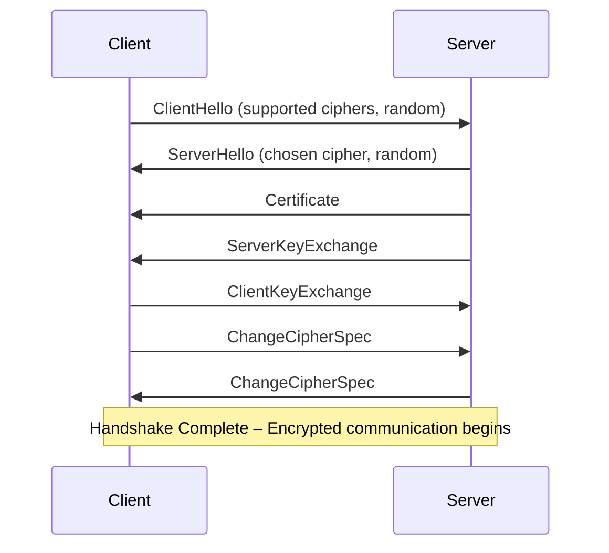

# Optimizing TLS for Speed: Handshake, Reuse, and Cipher Choice

TLS does what it’s supposed to: it keeps your connections private and trustworthy. But it also slows things down — a lot more than most people realize. In Go, if you care about how quickly your service responds, you can squeeze out better performance by tuning how TLS negotiates and what it negotiates.

## Understanding TLS Overhead: Where Performance Suffers

Most of the slowdown in TLS happens right at the start. The handshake is a back-and-forth process: picking algorithms, swapping keys, proving identities, and setting up the session. That back-and-forth usually takes two full trips across the network. In something like a trading platform or a real-time app, that delay is noticeable.

To make TLS faster, the most effective place to start is cutting down the handshake steps and making the crypto work less expensive.



## Session Resumption: Cutting Handshake Latency

Because every new TLS connection runs the entire handshake — negotiating ciphers, exchanging keys, verifying certificates — it introduces noticeable latency. Session resumption sidesteps most of that by reusing the cryptographic state from an earlier session, making reconnects much faster.

Session resumption is a mechanism in TLS to avoid repeating the full handshake on reconnect. There are two main approaches: session IDs and session tickets. Both rely on the idea that the server remembers (or encodes) the session’s cryptographic state from a prior connection. When a client reconnects, it presents either the session ID or the session ticket, allowing the server to restore the session state and skip expensive asymmetric key exchange.

A session ticket is a data blob issued by the server to the client at the end of the handshake. This ticket contains the encrypted session state (such as negotiated cipher suite, keys, and session parameters) and is opaque to the client. On reconnect, the client sends the ticket back, and the server decrypts it to resume the session without performing a full handshake.

In Go, you enable session resumption by setting up session ticket keys. The server uses these keys to encrypt and decrypt the session state that clients send back when resuming a connection. You can generate a secure 32‑byte key at startup with crypto/rand and reuse it if your service is running across multiple instances behind a load balancer. Just make sure to rotate the key now and then to keep it secure.

```go
tlsConfig := &tls.Config{
    SessionTicketsDisabled: false, // Enable session tickets explicitly
    SessionTicketKey: [32]byte{...}, // Persist securely and rotate periodically
}
```

What makes session resumption effective is that it avoids re‑doing the slowest parts of TLS. Instead of negotiating everything from scratch, the server decrypts the ticket, verifies it, and restores the session. That eliminates at least one full round trip and all the heavy asymmetric operations, which saves both time and resources.

## Choosing Cipher Suites Wisely

Cipher suites define the combination of algorithms used for key exchange, authentication, encryption, and integrity checking. Selecting efficient cipher suites significantly impacts performance.

Why prefer one over another? Some suites use RSA for key exchange, which is much slower than elliptic-curve Diffie–Hellman (ECDHE) and lacks forward secrecy. Suites with AES-GCM are faster on modern CPUs thanks to hardware acceleration, whereas older CBC-mode suites are slower and more error-prone. ECC-based authentication (ECDSA) also provides shorter signatures and lower computational cost compared to RSA.

To choose wisely:

* Prioritize suites with ECDHE for forward secrecy and better performance.
* Prefer AES-GCM over AES-CBC or ChaCha20 unless targeting hardware that lacks AES acceleration (where ChaCha20 may win).
* Avoid suites using only RSA for key exchange, because they lack forward secrecy and require more expensive computations on the server side.

The Go standard library ships with a solid set of secure and reasonably fast defaults. For most applications, you can stick with those and be fine. But if you’re tuning for a high‑performance environment, defining your own preferred cipher suites gives you tighter control over what gets negotiated.

An optimized config favors AES‑GCM for its hardware acceleration and ECC for its efficiency.

```go
tlsConfig := &tls.Config{
    CipherSuites: []uint16{
        tls.TLS_ECDHE_ECDSA_WITH_AES_128_GCM_SHA256,
        tls.TLS_ECDHE_RSA_WITH_AES_128_GCM_SHA256,
        tls.TLS_ECDHE_ECDSA_WITH_AES_256_GCM_SHA384,
        tls.TLS_ECDHE_RSA_WITH_AES_256_GCM_SHA384,
    },
    PreferServerCipherSuites: true,
}
```

These suites strike a good balance between security and speed, leveraging forward secrecy and hardware-accelerated encryption. The second option, TLS\_ECDHE\_RSA\_WITH\_AES\_128\_GCM\_SHA256, is a reasonable choice when clients may not support ECDSA certificates — it still provides forward secrecy and efficient AES-GCM encryption while relying on the more widely deployed RSA for authentication.

## Using ALPN Wisely

Application-Layer Protocol Negotiation (ALPN) lets clients and servers agree upon the application protocol (like HTTP/2, HTTP/1.1, or gRPC) during the TLS handshake, avoiding additional round trips or guessing after establishing the connection. Without ALPN, a client would have to fall back to slower or less efficient methods to detect the server’s supported protocol.

In Go, the `NextProtos` field in `tls.Config` defines which application protocols the server supports and in what order of preference. During the TLS handshake, the client sends its own list, and the server picks the highest‑priority protocol that both sides support, then confirms it.

If you want to support `HTTP/2` with a fallback to `HTTP/1.1`, you should set `NextProtos` explicitly, like this:

```go
tlsConfig := &tls.Config{
    NextProtos: []string{"h2", "http/1.1"},
}
```

The sequence of entries in `NextProtos` matters because the server walks the list in order and chooses the first protocol also offered by the client. By putting HTTP/2 (`h2`) at the top, the server ensures it prefers HTTP/2 when supported, falling back to HTTP/1.1 only when necessary. If the order is incorrect, the server may settle on a slower protocol or fail to agree entirely.

When `NextProtos` is left empty, ALPN is effectively disabled. The client assumes HTTP/1.1 because it never sees an indication of HTTP/2 support during the handshake. Explicitly setting `NextProtos` advertises the server’s capabilities and avoids unnecessary protocol downgrades.

## Minimizing Certificate Verification Overhead

Certificate verification tends to be CPU‑heavy because it involves several expensive asymmetric cryptographic operations, which directly increase connection latency. This cost can be reduced in two ways: by using smaller, faster‑to‑verify ECC‑based (ECDSA) certificates instead of RSA, and by caching already‑validated certificate chains to avoid repeating the same verification work on subsequent connections.

```go
tlsConfig := &tls.Config{
    ClientAuth: tls.RequireAndVerifyClientCert,
    ClientCAs: certPool, // pre-verified CA pool
    VerifyPeerCertificate: cachedCertVerifier, // custom verifier with caching
}
```

A basic caching mechanism stores verification outcomes temporarily:

```go
// Cache to avoid re-verifying the same certificate repeatedly
var verificationCache sync.Map

// cachedCertVerifier verifies a peer certificate chain and caches successful leaf fingerprints
func cachedCertVerifier(rawCerts [][]byte, verifiedChains [][]*x509.Certificate) error {
    // Compute SHA-256 fingerprint of the leaf certificate
    fingerprint := sha256.Sum256(rawCerts[0])
    if _, exists := verificationCache.Load(fingerprint); exists {
        // Already verified earlier; skip full verification
        return nil
    }

    // Parse the leaf certificate
    leafCert, err := x509.ParseCertificate(rawCerts[0])
    if err != nil {
        return fmt.Errorf("failed to parse leaf certificate: %w", err)
    }

    // Build pool of intermediate certificates provided by peer
    intermediatePool := x509.NewCertPool()
    for _, raw := range rawCerts[1:] {
        intermediateCert, err := x509.ParseCertificate(raw)
        if err != nil {
            return fmt.Errorf("failed to parse intermediate certificate: %w", err)
        }
        intermediatePool.AddCert(intermediateCert)
    }

    // Prepare verification options with trusted roots & intermediates
    opts := x509.VerifyOptions{
        Roots:         certPool,                            // trusted root CAs
        Intermediates: intermediatePool,                    // peer-provided intermediates
        KeyUsages:     []x509.ExtKeyUsage{x509.ExtKeyUsageServerAuth},
    }

    // Verify the full chain starting from leaf
    chains, err := leafCert.Verify(opts)
    if err == nil {
        // Store successful verification in cache
        verificationCache.Store(fingerprint, struct{}{})
    }
    return err
}
```

!!! warning
    While the snippet illustrates key concepts, it should not be used in production as-is. Cryptographic code demands careful analysis and adaptation to the specific environment and threat model. Always validate and test security-related code before deployment to avoid introducing weaknesses.

## TLS Best Practices in Go

The following configuration brings together these techniques into a tls.Config that is optimized for both performance and security.

The `MinVersion` setting tells the server to reject older, broken versions of TLS. Anything below TLS 1.2 — like SSLv3, TLS 1.0, or 1.1 — is riddled with weaknesses and no longer considered safe. TLS 1.2 fixed many of those problems by introducing AEAD ciphers like AES‑GCM and defenses against attacks such as BEAST and POODLE.

The `CurvePreferences` field prioritizes fast and secure elliptic curves supported by most clients. P-256 and X25519 are efficient, widely-supported, and often hardware-accelerated. P-256 (also known as secp256r1) is an NIST-recommended curve with broad compatibility and native support in most CPUs for fast computation. X25519 is a modern curve designed for both speed and simplicity, offering constant-time operations to resist side-channel attacks, and performs especially well on low-power or embedded devices.

Te rest parts were discussed in details above.

```go
tlsConfig := &tls.Config{
    SessionTicketsDisabled: false,
    SessionTicketKey: [32]byte{...},
    CipherSuites: []uint16{
        tls.TLS_ECDHE_ECDSA_WITH_AES_128_GCM_SHA256,
        tls.TLS_ECDHE_RSA_WITH_AES_128_GCM_SHA256,
        tls.TLS_ECDHE_ECDSA_WITH_AES_256_GCM_SHA384,
        tls.TLS_ECDHE_RSA_WITH_AES_256_GCM_SHA384,
    },
    PreferServerCipherSuites: true,
    NextProtos: []string{"h2", "http/1.1"},
    ClientAuth: tls.RequireAndVerifyClientCert,
    ClientCAs: certPool,
    VerifyPeerCertificate: cachedCertVerifier,
    MinVersion: tls.VersionTLS12,
    CurvePreferences: []tls.CurveID{tls.CurveP256, tls.X25519},
}
```

TLS optimization is about balancing performance and security effectively. By reducing handshake overhead through session reuse, wisely selecting cipher suites with ECC and hardware acceleration, efficiently leveraging ALPN, and minimizing certificate verification overhead through caching, Go applications can achieve both security and speed. This approach makes TLS less a performance bottleneck and more a seamless security foundation for modern network services.
